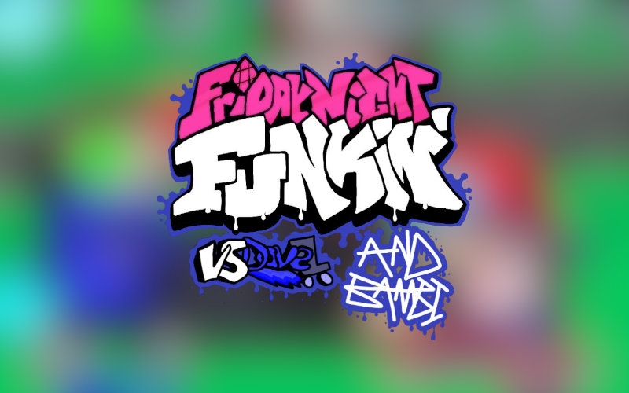

# WARNING
THE ENGINE IS AT A VERY UNSTABLE STATE AT THE MOMENT, IT HAS NO MODDING SUPPORT AT THE MOMENT, BUT IT WILL GET ADDED SOON.
IF YOU WANNA MAKE A MOD AT THE MOMENT, YOU WILL HAVE TO MODIFY THE SOURCE CODE.

# DAVE ENGINE
this is dave

say hi to dave
please say hi to him

## About the engine
Powered by a heavily modified version of Kade Engine, This includes lots of additional improvements such as
- OpenGL Shaders
- Character Selector
- Languages
- [Strawberry Input](https://github.com/benjaminpants/Funkin-Strawberry)

If you're looking to compile the mod/make your own modification, [look here](Modding.md).
